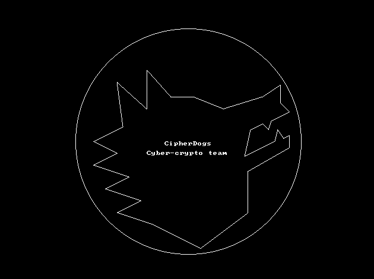

# cipherdogs-logo-lib


Library CipherDogs logo for the operating system



## Usage
```rust
use vga::colors::Color16;
use vga::writers::{Graphics640x480x16, GraphicsWriter};
use vga_figures::figures2d::Figures2D;

use cipherdogs_logo_lib;

let mode = Graphics640x480x16::new();
mode.set_mode();
mode.clear_screen(Color16::Black);

let figures = Figures2D::new(mode);

cipherdogs_logo_lib::draw(figures, Color16::White);
```
